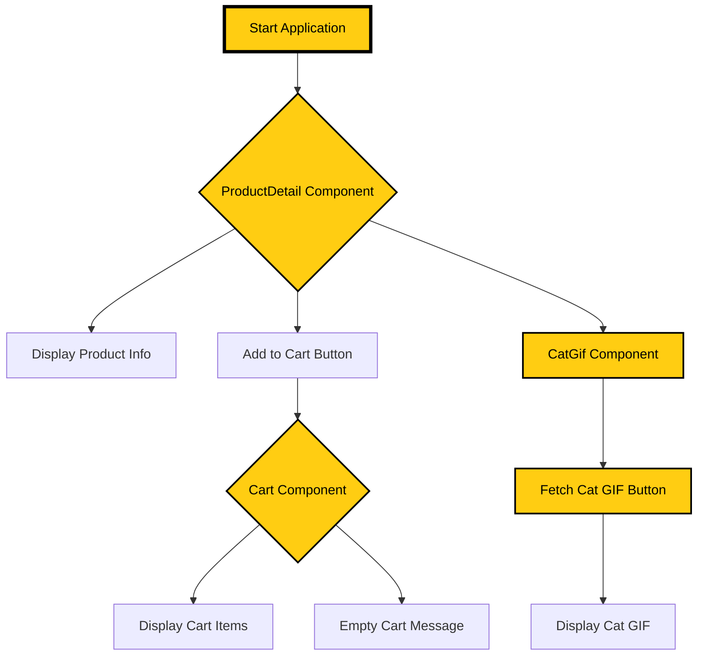

# Prescott1.myShoppingApp.io
This is a react web app that I create as a personal project. I'm working on developing a deeper understanding of how to create API request and improve my overall skills as inspiring developer.  
This project is a React-based web application showcasing a product catalog with the ability to view product details and add items to a shopping cart. It also features a dynamic component that fetches and displays a random cat GIF filtered by the 'orange' tag using the [Cat as a Service API](https://cataas.com/).

## Features

- **Product Details**: View details of products including images, names, and prices.
- **Add to Cart**: Ability to add products to a shopping cart stored in memory.
- **CartTotal**: Displays the total of all iteams within the cart.
- **Cat GIF**: Fetch and display a random orange cat GIF.

## Installation

To run this project, you will need to have Node.js and npm installed on your system. If you don't have them installed, you can download them from [Node.js official website](https://nodejs.org/).

Once Node.js and npm are installed, you can clone the project and install its dependencies.

```sh
git clone https://github.com/your-username/my-react-app.git
cd my-react-app
npm install
```

## Resources that I used to help me create this project are:
1) https://react.dev/
2) [Mozilla: Getting started with React](https://developer.mozilla.org/en-US/docs/Learn/Tools_and_testing/Client-side_JavaScript_frameworks/React_getting_started)
3) https://www.w3schools.com/REACT/DEFAULT.ASP
4) https://react-bootstrap.netlify.app/docs/components/cards/
5) [Google](https://www.google.com)
6) https://cataas.com/
7) https://mermaid.js.org/intro/
8) https://www.cat.com/en_US/products/new/equipment/drills.html

## Flowcart structure for this React App is:

